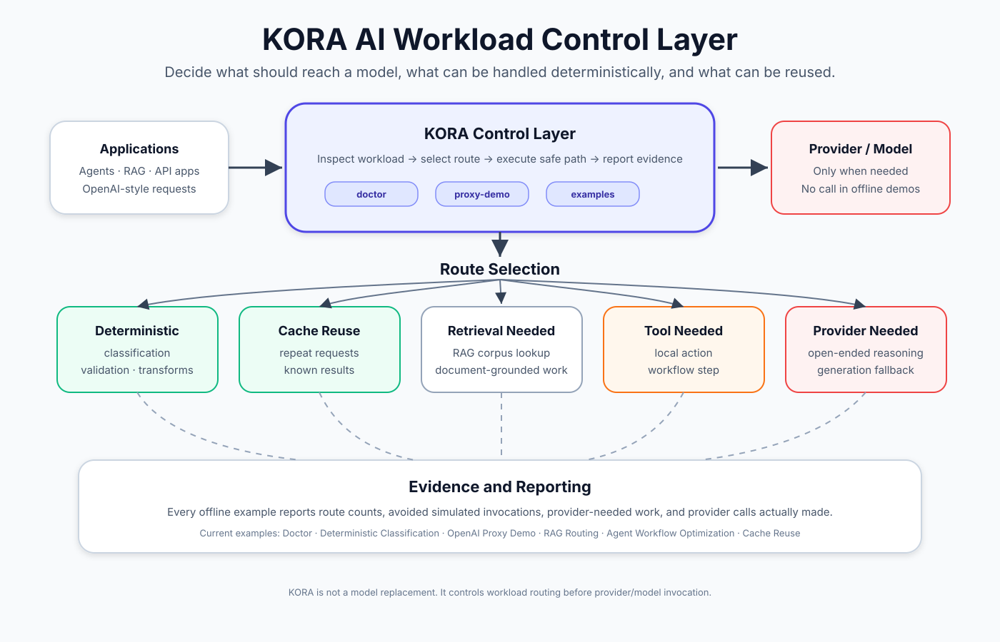

# KORA

**Deterministic-first execution control before model inference.**

KORA is an **AI Workload Control Layer** that inspects and routes deterministic, reusable, retrieval-needed, tool-needed, and provider-needed work before model inference.

Most AI systems treat every task as a model task. KORA starts one step earlier: it inspects the workload, chooses a route, and makes provider-needed work explicit.



[View the architecture diagram](docs/assets/kora_workload_control_layer_architecture.svg)

## What KORA Does

- Inspect workloads before deployment.
- Route deterministic work without provider calls.
- Reuse repeated work through cache paths.
- Separate retrieval-needed and tool-needed work.
- Mark provider-needed tasks explicitly.
- Inspect privacy-safe local device and runtime-candidate metadata.
- Run optional local execution paths through explicitly configured MLX or llama.cpp runtimes.
- Validate independently packaged AI Solutions before installation or execution.
- Build and query a deterministic local evidence index from text-layer PDFs.

## Quick Start

Current latest-feature use is from source:

```bash
git clone https://github.com/Krako-Labs/KORA.git
cd KORA
python3 -m pip install -e .
```

Run the first-value paths:

```bash
python3 -m kora doctor examples/kora_doctor/customer_support_workload.json
python3 -m kora proxy-demo examples/openai_compatible_proxy/requests.json
python3 examples/cache_reuse/run.py
```

Inspect the local system without starting a runtime or calling a provider:

```bash
python3 -m kora system inventory
```

### Solution Protocol v0alpha1

Validate the two bundled reference Solutions without executing them:

```bash
python3 -m kora solution validate examples/solutions/hello-solution --json
python3 -m kora solution validate examples/solutions/document-transform-fixture --json
```

The validator checks manifests, referenced JSON Schemas, Task Graphs, capability declarations, approvals, package paths, and SHA-256 integrity offline.

A bounded reference Host can then install and run either Solution through the same local lifecycle:

```bash
python3 -m kora solution install examples/solutions/hello-solution --store /tmp/kora-host --json
python3 -m kora solution run example.hello --store /tmp/kora-host --input examples/solutions/inputs/hello.json --json
```

The input file is a JSON object such as `{"message":"Hello"}`. The Host verifies the installed snapshot before execution and persists schema-validated status and result records. Its reference capabilities are deterministic and offline; stop/resume, provider/model/GPU execution, and production validation remain deferred. See [Solution Protocol v0alpha1](docs/solution-protocol-v0.md) and the [reference Solution guide](examples/solutions/README.md).

### Research Foundry Alpha

Install the optional PDF dependency, ingest your own or public text-layer PDFs, and retrieve an evidence card:

```bash
python3 -m pip install -e '.[research]'
python3 -m kora research ingest ./papers --state-dir ./.kora-research --json
python3 -m kora research query ./.kora-research "reflection tokens" --top-k 3 --markdown
```

Research Foundry is an implemented reference vertical, not the definition of the KORA platform. Its output is deterministic retrieved evidence—not model-generated synthesis. Each result includes a source title, page, stable chunk/evidence ID, and verbatim retrieved excerpt. State remains in the directory you explicitly select. See [Research Foundry Alpha](docs/research-foundry-alpha.md) for its Local Only boundary and limitations.

### Optional local runtime adapters

KORA includes fail-closed adapters named `mlx_local` and `llama_cpp_local`. They use only explicitly configured local runtimes and model files, never download a model or fall back to a remote provider. These are secondary execution adapters rather than a production-serving claim; see their environment-variable validation in the adapter modules and focused tests.

## Package Availability

`pip install kora` is **not** this project.

The planned future PyPI package name is `getkora`, with CLI command `kora` and Python import package `kora`.

`getkora` is not published yet. Use the source install path above for the latest KORA features.

## Flagship Examples

| Example | Shows | Run | Details |
| --- | --- | --- | --- |
| KORA Doctor | Workload inspection | `python3 -m kora doctor examples/kora_doctor/customer_support_workload.json` | [README](examples/kora_doctor/README.md) |
| Deterministic Classification | Rule-routed classification | `python3 examples/deterministic_classification/run.py` | [README](examples/deterministic_classification/README.md) |
| OpenAI-Compatible Proxy | OpenAI-style request routing | `python3 -m kora proxy-demo examples/openai_compatible_proxy/requests.json` | [README](examples/openai_compatible_proxy/README.md) |
| RAG Routing | Retrieval-aware control | `python3 examples/rag_routing/run.py` | [README](examples/rag_routing/README.md) |
| Agent Workflow Optimization | Multi-step workflow routing | `python3 examples/agent_workflow_optimization/run.py` | [README](examples/agent_workflow_optimization/README.md) |
| Cache Reuse | Repeated-work reuse | `python3 examples/cache_reuse/run.py` | [README](examples/cache_reuse/README.md) |

See the full [example catalog](examples/README.md).

## How It Works

A workload enters KORA before it reaches a model.

KORA evaluates each unit of work and routes it to one of several paths:

- deterministic handling
- cache reuse
- retrieval-needed handling
- tool-needed handling
- provider-needed fallback

The included examples are offline and make zero provider calls.

## Evidence Boundaries

In a reproducible 100-task deterministic-heavy benchmark workload, KORA-controlled execution avoided 80 of 100 simulated model invocations versus a naive direct baseline. This is a bounded simulated benchmark result, not production, cost-saving, model-quality, or broader workload evidence. See the [benchmark report](docs/benchmarks/kora_benchmark_result_v1_100.md).

The repository does **not** claim:

- production cost reduction proof
- real API-cost reduction proof beyond the single-domain benchmark above
- production readiness
- benchmark superiority
- full OpenAI API compatibility
- production RAG, agent, or cache correctness
- Research Foundry extraction accuracy, retrieval relevance, factuality, or synthesis
- model replacement

See the [claim registry](docs/claims/kora-claim-registry.md) and [public language guide](docs/claims/kora-public-language-guide.md).

## Documentation

- [Documentation index](docs/README.md)
- [Solution Protocol v0alpha1](docs/solution-protocol-v0.md)
- [Vision: AI Workload Control Layer](docs/vision/kora_workload_control_layer.md)
- [Example catalog](examples/README.md)
- [Packaging: getkora strategy](docs/packaging/getkora_distribution_strategy.md)
- [Reports and evidence](docs/reports/)
- [Contributing](CONTRIBUTING.md)

## License

Apache License 2.0. See [LICENSE](LICENSE).
