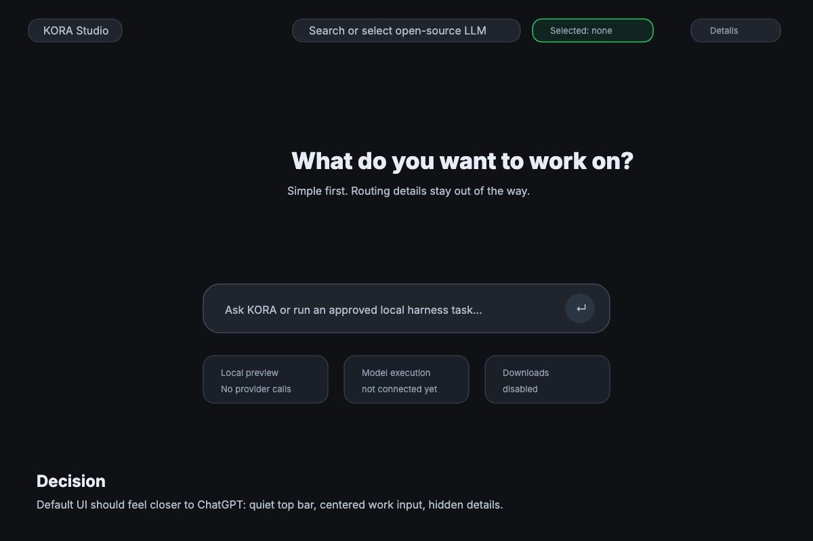
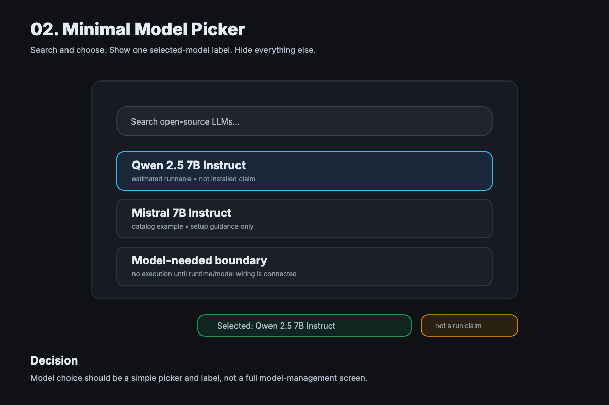
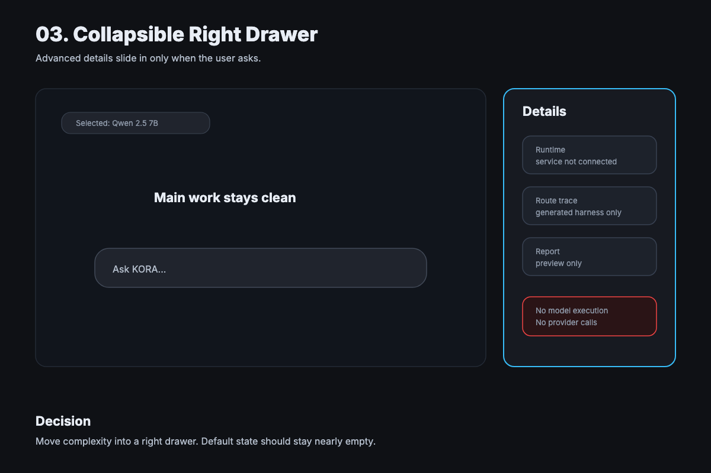

# KORA Studio v0.7 Chat-First Minimal UI/UX Boards

## Status

These boards are the preferred source of truth for the next KORA Studio UI direction.

The previous split boards were still too workbench-heavy. This direction is more minimal: a chat-like web app surface with a quiet top model picker, one central work area, and a right-side drawer for details.

Implementation should wait for review.

## Board 01 - Home

Decision:

- Default state should feel close to a minimal chat web app.
- Keep the page mostly empty until the user works.
- Show only top-level model selection and local boundary status.
- Keep routing details out of the way.

Editable source:

- `assets/kora-studio-v0-7-chat-01-home.svg`

## Board 02 - Model Picker

Decision:

- Put open-source LLM search and selection at the top.
- After selection, show one compact selected-model label.
- Do not show a full model-management dashboard by default.
- Selection is not an install, download, or run claim.

Editable source:

- `assets/kora-studio-v0-7-chat-02-model-picker.svg`

## Board 03 - Right Drawer

Decision:

- Hide advanced runtime, route, report, and boundary details in a right-side drawer.
- The drawer should slide in only when requested.
- The main work surface should remain clean.
- Claim boundaries stay visible inside the drawer and near risky actions.

Editable source:

- `assets/kora-studio-v0-7-chat-03-drawer.svg`

## Design Rules

- Use a chat-first surface.
- Keep the first screen sparse.
- Put model search/selection at the top.
- Show selected model as a small label.
- Use a right-side drawer for details and settings.
- Do not expose dense counters, traces, and report metadata by default.
- Do not add arbitrary prompt execution until explicitly scoped.
- Do not imply model execution, downloads, provider calls, or production evidence.

## Product Boundary

The intended long-term UX can feel like "select a free/open model and work", but current implementation boundaries remain:

- model execution is not connected
- downloads are disabled
- provider calls are disabled
- cloud sync is disabled
- installed model detection is not connected unless explicitly implemented later
- catalog examples are not installed models
- model-needed boundaries return `execution_not_connected`

## Approval Questions

- Should the first screen be this chat-first surface?
- Should model search/selection live in the top bar?
- Should the selected model appear as a compact top label?
- Should route/runtime/report details be hidden in the right drawer by default?
- Should the old workbench-style boards be retired for implementation planning?
