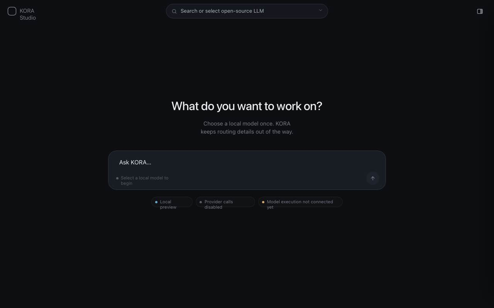

# KORA Studio v0.7 Claude Design Source of Truth

## Status

This document records the Claude Design artifact review for KORA Studio v0.7 UI direction.

The approved direction is a minimal, chat-first web app surface. It should feel closer to ChatGPT than to a dense model-management or settings application.

This is a design source of truth, not an implementation commit. Product code should adapt the design into the current KORA Studio server constraints and must preserve all local-only and claim-safe boundaries.

## Source Artifacts

Screenshots:

- [01 empty state](design/claude-v0-7/01-empty.png)
- [02 empty state variant](design/claude-v0-7/02-empty.png)
- [03 empty state variant](design/claude-v0-7/03-empty.png)

Reference source files:

- [KORA-Studio.html](design/claude-v0-7/KORA-Studio.html)
- [kora-app.jsx](design/claude-v0-7/kora-app.jsx)
- [kora-panels.jsx](design/claude-v0-7/kora-panels.jsx)
- [kora.css](design/claude-v0-7/kora.css)

Important implementation note:

- The reference HTML uses external CDN scripts and Google Fonts.
- The reference includes design/prototype code, not production-ready KORA Studio code.
- KORA implementation must not add external CDN dependencies or external network requirements.

## Visual Direction

Use the Claude Design screenshots as the visual target:

Core visual qualities:

- sparse dark surface
- quiet top bar
- centered work prompt
- one large composer
- small boundary pills below the composer
- model selection in the top center
- details icon at top right
- advanced information hidden by default
- very low panel count on first load

## Required App Structure

### Top Bar

Required:

- KORA Studio brand at top left
- centered model search/select control
- right-side details button
- optional selected model/status chip after selection

The model control should say:

- `Search or select open-source LLM`

After model selection, show a compact selected-model label.

### Main Work Surface

Required:

- centered headline
- short supporting copy
- large rounded composer
- small submit/routing button
- compact status pills

Preferred headline:

- `What do you want to work on?`

Preferred supporting copy:

- `Choose a local model once. KORA keeps routing details out of the way.`

Composer placeholder:

- `Ask KORA...`

Status pills:

- `Local preview`
- `Provider calls disabled`
- `Model execution not connected yet`

### Model Picker

Required:

- opens from top model control
- includes model search
- lists catalog/estimated model rows
- marks whether a row is a catalog example or estimated runnable
- never claims a model is installed unless detection is safely connected
- never claims execution is connected unless runtime execution is actually connected

Required taxonomy:

- Catalog example
- Estimated runnable
- Installed locally
- Execution connected

Current default must show no execution connection.

### Right Drawer

Required:

- hidden by default
- slides in from the right
- acts as details/inspector surface
- should not dominate the first screen

Drawer sections:

- Runtime status
- Selected model
- Catalog vs installed
- Route trace
- Generated counters
- Report metadata
- Claims / boundaries

The drawer may use accordion sections.

## Implementation Criteria

When adapting this design into KORA Studio:

- keep the first screen sparse
- do not show a dense dashboard on load
- do not show route trace by default
- do not show counters by default
- do not show report metadata by default
- use the right drawer for advanced details
- keep model selection at the top
- keep selected model as a small status label
- keep boundary pills short
- keep public copy claim-safe

## Do Not Copy Directly

Do not copy these implementation aspects directly into product code:

- external React CDN scripts
- Babel standalone runtime
- Google Fonts import
- design tweak panel behavior
- any dependency that creates network requirements

Use the artifact as a design reference only.

## Claim Boundaries

The implementation must preserve:

- local preview only
- provider calls disabled
- cloud sync disabled
- model execution not connected yet
- downloads disabled unless explicitly implemented later
- catalog examples are not installed models
- model recommendations are estimates until validated
- KORA does not remove model memory requirements
- no arbitrary provider/API call
- no runtime model listing
- no private model directory scanning
- no production cost or energy claim
- not an LM Studio replacement

## Accepted Design Decisions

Accepted:

- ChatGPT-like minimal first screen
- top model selector
- compact selected model label
- centered composer
- small status pills
- hidden right details drawer
- drawer-based route/runtime/report inspection

Rejected for v0.7 implementation:

- dense workbench layout
- always-visible route trace
- always-visible counters
- always-visible report metadata
- left navigation as the primary layout
- full model-management dashboard on first load

## Next Implementation Task

Next task should scaffold the KORA Studio local preview toward this layout:

- no new runtime behavior
- no external CDN
- no new dependency installation
- no provider calls
- no model execution
- no downloads
- keep existing `/health`, `/status`, `/`, and harness endpoints intact
