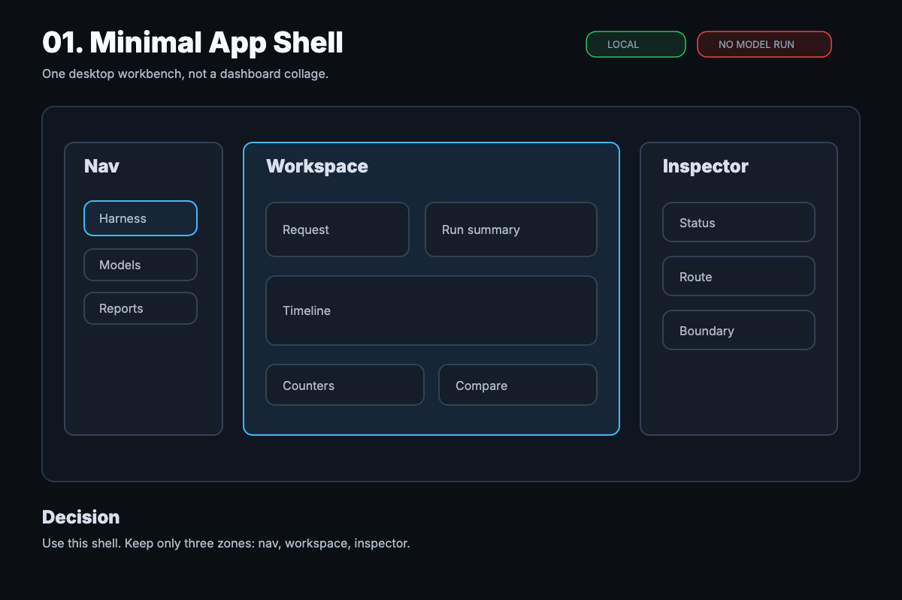
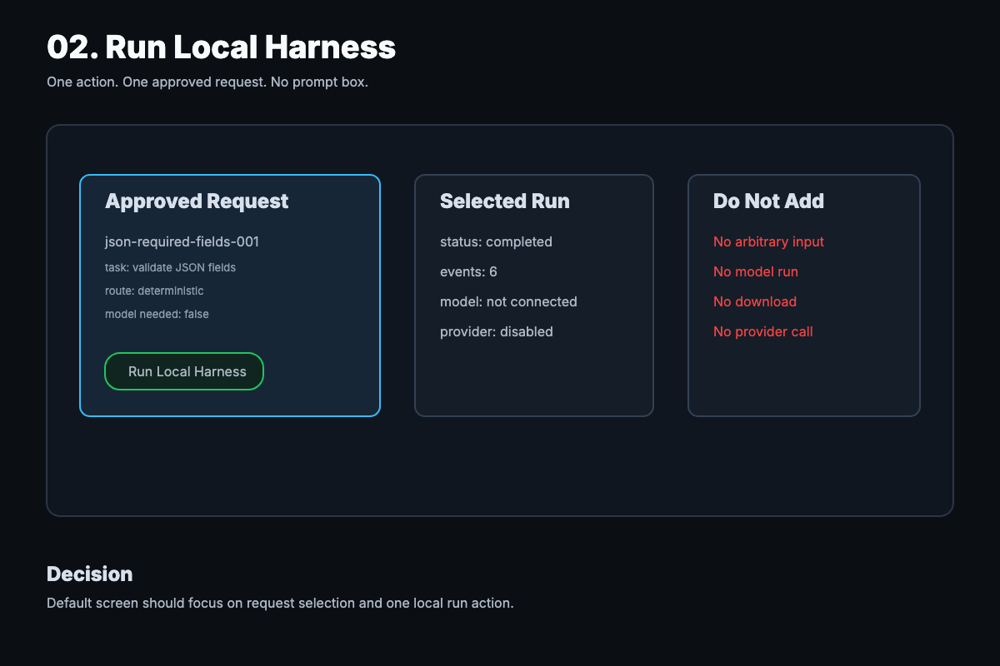
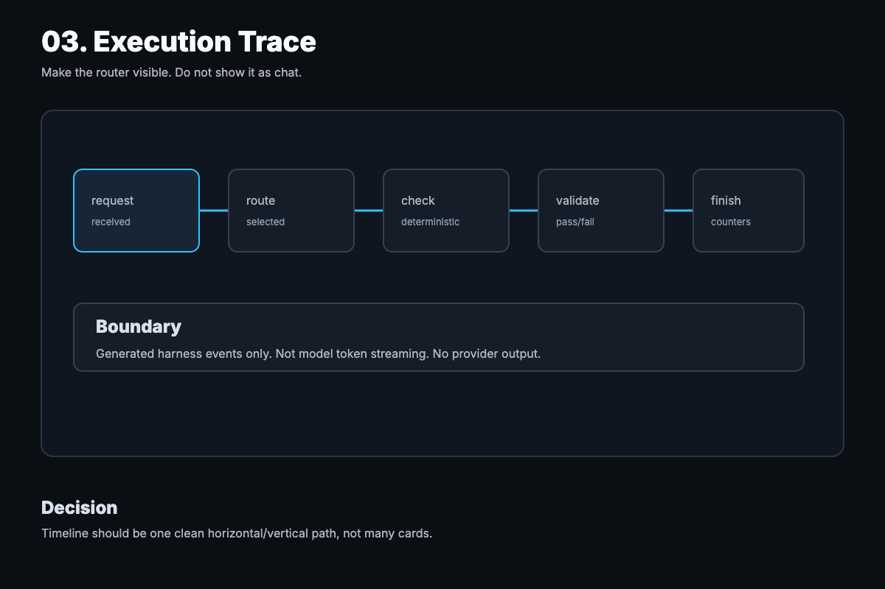
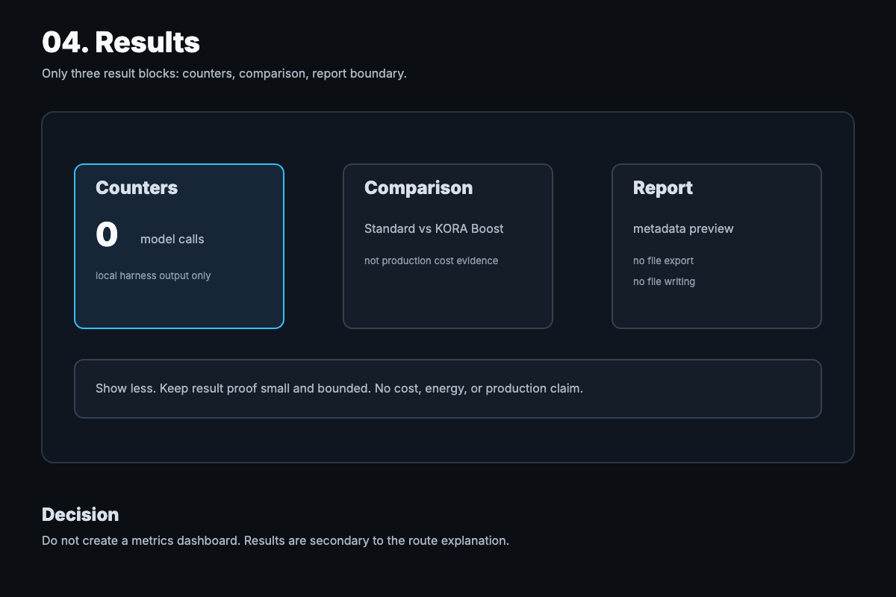
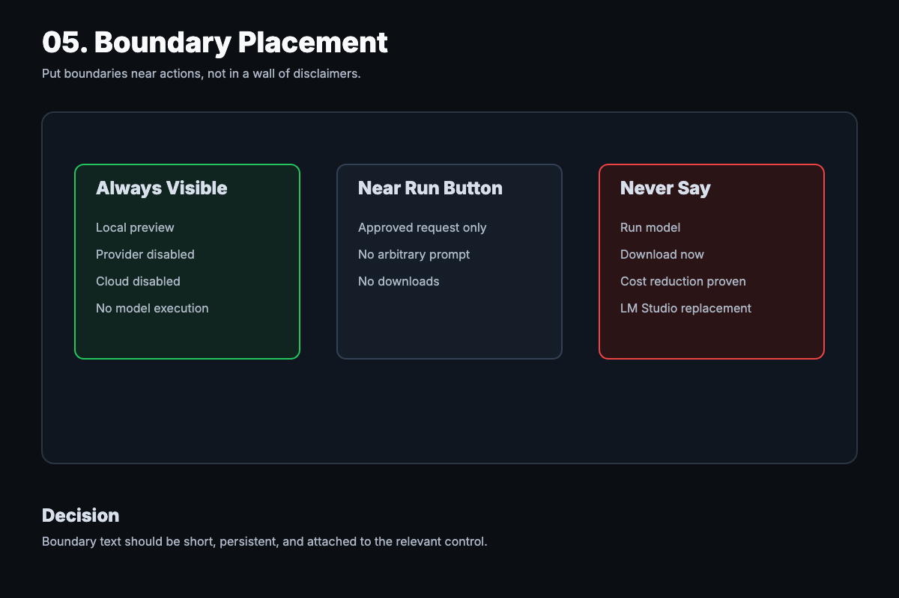

# KORA Studio v0.7 Minimal UI/UX Boards

## Status

These boards replace the previous one-page comprehensive board as the preferred approval artifact.

The goal is to make the next KORA Studio UI direction simple enough to inspect before implementation. Each board covers one decision only.

Implementation should wait until these boards are reviewed.

## Board 01 - Minimal App Shell

Decision:

- Use one desktop workbench shell.
- Keep only three zones: navigation, workspace, inspector.
- Do not turn the first screen into a dense dashboard.

Editable source:

- `assets/kora-studio-v0-7-board-01-shell.svg`

## Board 02 - Run Local Harness

Decision:

- Default interaction is one approved request and one Run Local Harness button.
- No arbitrary prompt box.
- No model/provider/download behavior.

Editable source:

- `assets/kora-studio-v0-7-board-02-run.svg`

## Board 03 - Execution Trace

Decision:

- Make the execution router visible through a single clean path.
- Keep the trace readable.
- Do not show it as chat or a generic log dump.

Editable source:

- `assets/kora-studio-v0-7-board-03-trace.svg`

## Board 04 - Results

Decision:

- Results should be secondary to route explanation.
- Use only three result blocks: counters, comparison, report boundary.
- Do not create a production metrics dashboard.

Editable source:

- `assets/kora-studio-v0-7-board-04-results.svg`

## Board 05 - Boundary Placement

Decision:

- Put boundary text near the relevant action.
- Keep boundary text short and persistent.
- Never imply active model execution, downloads, providers, or production evidence.

Editable source:

- `assets/kora-studio-v0-7-board-05-boundaries.svg`

## Minimal Design Rules

- One screen should have one dominant job.
- Use fewer cards.
- Prefer a single route trace over many disconnected panels.
- Keep status and boundaries short.
- Hide or move secondary explanation below the fold.
- Do not introduce arbitrary prompt input.
- Do not introduce real model execution.
- Do not introduce provider calls.
- Do not introduce downloads.
- Do not introduce report export.

## Approval Checklist

Approve or revise:

- Board 01 shell structure
- Board 02 default run interaction
- Board 03 trace direction
- Board 04 result block count
- Board 05 boundary placement

After approval, the next implementation task should scaffold only the approved app shell and should not add new runtime behavior.
