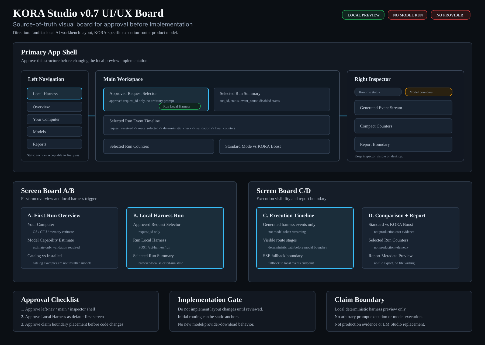

# KORA Studio v0.7 UI/UX Board



## Status

This is an approval board for the next KORA Studio UI direction. It is not an implementation spec until reviewed and approved.

The SVG above is the visual source of truth for this approval pass. The sections below explain the same layout, boundaries, and implementation gates in text form.

KORA Studio v0.7 should move the local preview toward a more coherent desktop workspace layout. The preferred visual direction may borrow familiar desktop AI-workbench patterns from tools such as LM Studio, but KORA Studio must remain positioned as a local-first AI Task Execution Router workspace, not an LM Studio replacement and not a generic local chatbot.

## Approval Gate

Implementation should not start until this board is reviewed.

Review decisions needed:

- approve the proposed information architecture
- approve the left navigation categories
- approve the main workspace layout
- approve the right-side execution inspector
- approve claim-boundary placement
- approve which v0.6 surfaces move into the first redesigned screen
- reject or revise any wording that overstates runtime/model capability

## Product Boundary

KORA Studio should show how local AI workflow routing works:

- local system and runtime status
- approved deterministic sample requests
- local harness run state
- generated event timeline
- Standard Mode vs KORA Boost comparison
- generated counters
- report metadata preview
- model/catalog/setup boundaries

KORA Studio must not imply:

- production readiness
- LM Studio replacement
- arbitrary prompt execution
- real model execution
- provider calls
- model downloads
- cloud sync
- private model directory scanning
- runtime model list commands
- report file export
- production cost reduction
- energy outcome
- unsupported larger-model execution

## Design Direction

The UI should feel like a local desktop workbench:

- left rail navigation
- dense but readable panels
- clear selected state
- status indicators near the top
- a central task workspace
- a right-side inspector for route/events/counters
- restrained dark theme
- compact cards with 8px or smaller radius
- no marketing-style hero page
- no decorative blobs or large gradient art

LM Studio-like references to preserve:

- desktop app/workbench feel
- model/runtime status visibility
- compact left navigation
- clear local status and machine context
- model/capability paneling

KORA-specific differences to preserve:

- the model is one execution path, not the whole product
- route decisions are first-class UI objects
- deterministic and structured paths are visible before model-needed boundaries
- KORA Boost is shown through execution path differences, not vague claims
- model-needed boundaries do not execute models in the current milestone

## Proposed App Shell

```text
┌──────────────────────────────────────────────────────────────────────────────┐
│ KORA Studio                         Local-only  Provider off  Cloud off      │
├───────────────┬──────────────────────────────────────────┬───────────────────┤
│ Navigation    │ Main Workspace                           │ Inspector         │
│               │                                          │                   │
│  Overview     │  Selected approved request               │  Runtime status   │
│  Computer     │  Run Local Harness                       │  Route boundary   │
│  Harness      │  Selected run summary                    │  Event stream     │
│  Models       │  Selected run event timeline             │  Counters         │
│  Reports      │  Standard vs KORA Boost comparison       │  Report metadata  │
│  Settings     │                                          │  Claim boundary   │
└───────────────┴──────────────────────────────────────────┴───────────────────┘
```

## Proposed First Screen

The first screen should open directly into a usable local harness workspace, not a landing page.

### Top Status Bar

Purpose: Make the local boundary visible at all times.

Content:

- local server status
- provider calls disabled
- cloud sync disabled
- model execution disabled
- downloads disabled
- active run id, if selected

Safe copy:

- "Local preview"
- "Provider calls disabled"
- "Cloud sync disabled"
- "No model execution"
- "Downloads disabled"

### Left Navigation

Purpose: Let the user understand Studio as a workspace rather than a single page.

Proposed sections:

- Overview
- Your Computer
- Local Harness
- Models
- Reports
- Settings

Initial v0.7 implementation can keep the navigation as static anchors if full routing is too broad.

### Main Workspace

Purpose: Put the local harness interaction in the center.

Sections:

- Approved Request Selector
- Run Local Harness
- Selected Run Summary
- Selected Run Event Timeline
- Standard Mode vs KORA Boost
- Selected Run Counters
- Selected Run Report Metadata

The central workspace should avoid arbitrary prompt input until a future explicitly bounded milestone.

### Right Inspector

Purpose: Keep the selected run explainable without forcing the user to scroll.

Panels:

- Runtime Status
- Selected Route
- Model-needed Boundary
- Generated Event Stream
- Compact Counters
- Report Boundary

The inspector should stay narrow and information-dense.

## Proposed Screen Boards

### Board A - First-Run Overview

```text
┌───────────────┬──────────────────────────────────────────┬───────────────────┐
│ Overview      │ Your Computer                            │ Status Inspector  │
│ Computer      │ - OS / CPU / memory estimate             │ Local-only        │
│ Harness       │ - model capability estimate              │ Provider off      │
│ Models        │ - runtime executable status              │ Cloud off         │
│ Reports       │                                          │ Downloads off     │
│ Settings      │ Catalog vs Installed                     │ Model execution   │
│               │ - catalog examples                       │ not connected     │
│               │ - installed detection not connected      │                   │
└───────────────┴──────────────────────────────────────────┴───────────────────┘
```

Goal: Orient the user before they run a sample.

### Board B - Local Harness Run

```text
┌───────────────┬──────────────────────────────────────────┬───────────────────┐
│ Harness       │ Approved Request Selector                │ Run Inspector     │
│               │ [json required fields] [faq lookup]      │ Active run id     │
│               │ [normalize record] [model-needed]        │ Route class       │
│               │                                          │ Model called: no  │
│               │ Run Local Harness                        │ Provider: off     │
│               │                                          │ Cloud: off        │
│               │ Selected Run Summary                     │                   │
└───────────────┴──────────────────────────────────────────┴───────────────────┘
```

Goal: Make the approved request trigger obvious while keeping arbitrary prompt input absent.

### Board C - Execution Timeline

```text
┌───────────────┬──────────────────────────────────────────┬───────────────────┐
│ Harness       │ Selected Run Event Timeline              │ Event Stream      │
│               │ 1 request_received                       │ generated only    │
│               │ 2 route_selected                         │ not token stream  │
│               │ 3 deterministic_check                    │ no provider       │
│               │ 4 validation                             │ no model output   │
│               │ 5 final_counters                         │                   │
└───────────────┴──────────────────────────────────────────┴───────────────────┘
```

Goal: Show KORA as an execution router through visible stages.

### Board D - Comparison and Report

```text
┌───────────────┬──────────────────────────────────────────┬───────────────────┐
│ Reports       │ Standard Mode vs KORA Boost              │ Report Metadata   │
│               │ baseline_model_calls                     │ preview only      │
│               │ kora_model_calls                         │ no file export    │
│               │ avoided_model_calls                      │ no file writing   │
│               │ deterministic_routes                     │ not evidence      │
│               │                                          │                   │
│               │ Selected Run Counters                    │                   │
└───────────────┴──────────────────────────────────────────┴───────────────────┘
```

Goal: Keep comparison visible while avoiding production cost/energy claims.

## Component Inventory

### Navigation Item

- label
- icon placeholder if implemented later
- active state
- disabled/planned state

### Status Pill

- label
- value
- state: neutral, ready, disabled, warning

### Approved Request Card

- request id
- summary
- task family
- expected route class
- model-needed boundary
- selected state

### Run Button

- label: "Run Local Harness"
- enabled only for approved request IDs
- loading state
- disabled state if no approved request selected

### Selected Run Summary

- run id
- request id
- status
- event count
- model execution status
- provider calls disabled
- cloud sync disabled
- file export disabled
- claim boundary

### Event Timeline Row

- stage order
- stage name
- route class
- status
- model called
- deterministic route used
- validation result
- latency if available

### Counter Strip

- total requests
- baseline model calls
- KORA model calls
- avoided model calls
- deterministic routes
- model escalations
- validation pass/fail counts

### Report Metadata Panel

- report status
- report source
- run id
- request id
- event count
- comparison summary status
- file export disabled
- file written false
- claim boundary

## Wording Board

Use:

- "KORA Studio is a local-first AI Task Execution Router workspace."
- "Approved local harness requests only."
- "Generated local harness output only."
- "No arbitrary prompt execution."
- "No model execution."
- "Provider calls disabled."
- "Cloud sync disabled."
- "Downloads disabled."
- "Report metadata preview only."
- "Not production evidence."
- "Model-needed boundary returns execution_not_connected."

Avoid:

- "Run any prompt"
- "Run model"
- "Download model"
- "Production benchmark"
- "Cost reduction proven"
- "Energy reduction"
- "All open-source LLMs supported"
- "KORA runs unsupported larger models"
- "LM Studio replacement"

## Visual Rules

- Use a dark neutral base with restrained accent colors.
- Keep dense operational panels readable.
- Use cards only for individual panels and repeated items.
- Do not nest cards inside cards.
- Keep section headers compact.
- Avoid large marketing heroes.
- Avoid decorative gradient blobs.
- Keep buttons visually distinct from status pills.
- Use disabled/planned controls only where the action is not connected.
- Make claim boundaries visible near the affected UI surface.

## Proposed v0.7 Task Sequence

### Task 456 - UI/UX Board Approval

Create this board and wait for review before implementation.

### Task 457 - App Shell Layout Scaffold

Implement the approved app shell layout with left navigation, top status bar, main workspace, and right inspector. No new runtime behavior.

### Task 458 - Harness Workspace Recomposition

Move approved request selector, run button, selected run summary, timeline, counters, comparison, and report metadata into the approved shell.

### Task 459 - Model and Runtime Panels Recomposition

Recompose existing system profile, runtime status, catalog vs installed, and setup guidance into the approved shell.

### Task 460 - Visual QA and Responsiveness Pass

Validate desktop and narrow viewport layout, copy boundaries, disabled states, and smoke checks.

## Review Checklist

Before implementation, confirm:

- The layout should follow this left-nav/main-workspace/right-inspector model.
- The first screen should open into Local Harness rather than Overview.
- The top status bar should stay visible.
- The right inspector should remain visible on desktop.
- The mobile/narrow layout should stack inspector below the main workspace.
- The wording is claim-safe.
- The navigation labels are acceptable.
- The v0.7 task sequence is acceptable.
